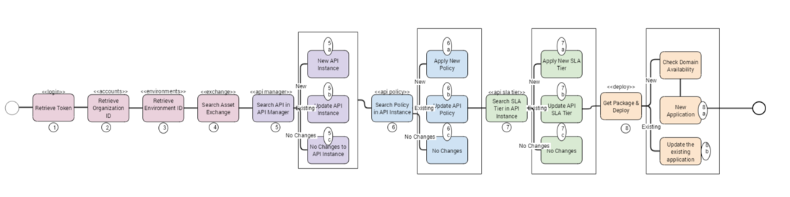

# ci-cd-powershell-script

This repository has the scripts that are required to deploy APIs to Cloud Hub. Scripts provides functionality for 
  - API Management
    - Create/Update API Manager Instance for API or just update the API Asset Specification
    - Create/Update Policy
    - Create/Update SLA Tiers
  - Application Deployment
    - Create/Update the Application in Cloudhub (Deployment model)

# Script description
High level script deployment flow is mentioned below



1. Retrieve the accesstoken for the REST API authentication based on the user credentials passed as input.
2. Retrieve the organizationID based on the business group name passed on as input.
3. Retrieve the environment ID based on the environment name passed on as input
4. Search Anypoint exchange based on the groupId,assetId and assetVersion specified in the input json file.
5. Search API manager to check if API Instance is already create for combination of groupId, assetId, assetVersion and instanceLabel (if provided).
    - If API Manager instance is not available create the new one based on the exchange asset.
    - If API manager instance is available and request to update the changespecification then update the API instance.
    - Reuse the same API manager instance if instance is available and no change is required. 
6. Retrieve all the policies already applied to API manager instance.
    - if no policies applied, apply new policy specified in the input file for that API Manager instance.
    - if the same policy exist but values are different update the policy information based on the policyid retrieved c. No Changes to the API policy.
7. Retrieve all SLA Tier information already applied to API manager instance
    - if no SLA Tier information applied, apply the SLA tier specified in the input file for that API Manager instance. 
    - if the same SLA Tier exist but values are different update the SLA Tier information based on the tierId.
    - No changes to the API SLA Tier
8. Get Package binary from the Artifactory
    - Check if the application already exist based on the application name passed as input.
    - if the application does not exist then check if the domain is available for deployment.
    - if domain is available, then deploy the new application based on the input parameters like region, num of workers, workertype,
applicationname ,mule.env, mule.key and other input parameters.
    - If application already exist then update the application based on the input parameters like region, num of workers, workertype,
applicationname ,mule.env, mule.key and other input parameters

## Script parameters

| Parameter Name | Parameter Description | Required|
| ------------- | ------------- |------------- |
| AnyPointUser  | Anypoint platform user performing the deployment.  | Y |
| AnyPointPwd  | Anypoint platform credentials for user performing the deployment. | Y|
| AnyPointOrgName  | Anypoint platform organization or business group to which application belongs to | Y |
| AnyPointEnvName  | Anypoint platform enviornment in which application will be deployed | Y|
| InputFile  | Deployment pipeline configuration file for an application and this file will be created by developer and checked in as part code.  | Y |
| Environment  | Same value as -AnyPointEnvName parameter | Y|
| MuleVersion  | Mule Runtime version  | Y |
| Region  | Mule Cloudhub region to deploy the application | Y|
| NumWorkers  | Number of mule application worker instance you want to deploy | Y |
| WorkerType  | Worker resource size for cloud hub deployment MICRO (0.1 vCores) SMALL (0.2 vCores) MEDIUM (1 vCore ) LARGE (2 vCores) XLARGE (4 vCores) XXLARGE (8 vCores) 4XLARGE (16 vCores) | Y|
| APIJarFileLocation  | Application jar file created as part of build  | Y |
| PlatformClientID  | Anypoint platform client id to runtime manager to connect to API management | Y|
| PlatformClientSecret  | Anypoint platform client secret to runtime manager to connect to API management  | Y |
| MuleKey  | Mule key used to encrypt/decrypt the properties file | Y|
| CompanyAbbreviation  | Application prefix uniquely identify the application | Y|
| SplunkURL  | Splunk URL application connects to send log event  | Y |
| SplunkToken  | Splunk token to connect to Splunk HTTP Event Collector | Y|
| SplunkToken  | Application deployment suffix to differentiate this application from the already existing one | Y|

### Input File (Deployment pipeline configuration file used in the script)

```
{
  "exchangeAssetInfo": {
    "name": "sample-test-api",
    "groupId": "d2a5a6a3-01ad-4071-8a91-23f174445efg",
    "assetId": "sample-test-api",
    "version": "1.0.0",
    "productVersion": "v1",
    "type": "oas"
  },
  "apiManagement": [
    {
    "env": "",
    "instanceLabel": null,
    "changeSpecification": false,
    "policies": [
      {
        "policyOverride": false,
        "configurationData": {
          "credentialsOriginHasHttpBasicAuthenticationHeader": "customExpression",
          "clientIdExpression": "#[attributes.headers['client_id']]",
          "clientSecretExpression": "#[attributes.headers['client_secret']]"
        },
        "pointcutData": null,
        "policyTemplateId": 269464,
        "groupId": "68ef9520-24e9-4cf2-b2f5-620025690913",
        "assetId": "client-id-enforcement",
        "assetVersion": "1.2.0"
      }
    ],
    "SLATier": [{
      "name": "standard",
      "description": "Standard-SLA-Tier",
      "autoApprove": false,
      "status": "ACTIVE",
      "limits": [
      {
        "visible": true,
        "timePeriodInMilliseconds": 10,
        "maximumRequests": 1
      },
      {
        "visible": true,
        "maximumRequests": 4,
        "timePeriodInMilliseconds": 36000000
      }
    ]
    }]
  }
]
}

```
# Contributors
Srinivasan Raghunathan
